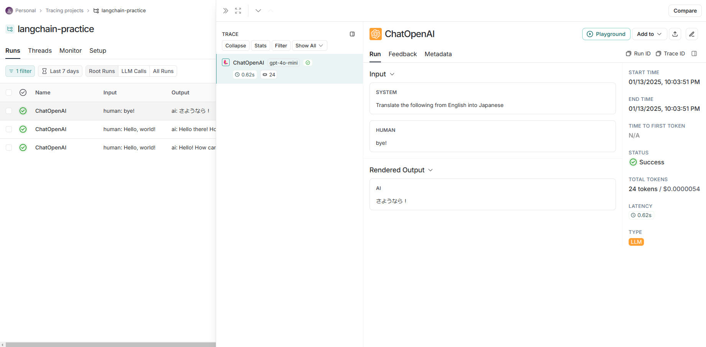
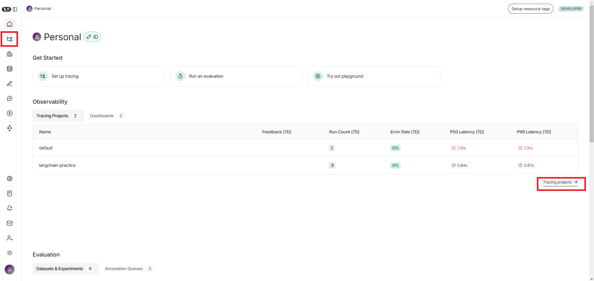
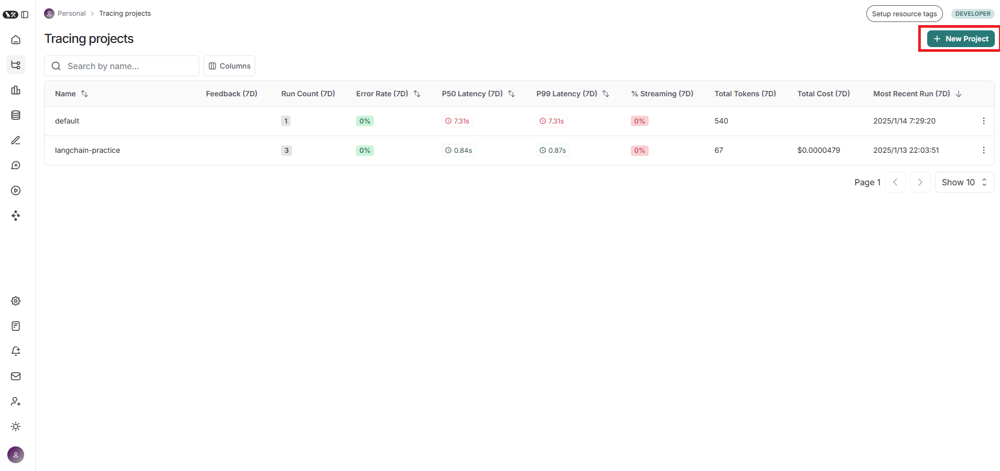
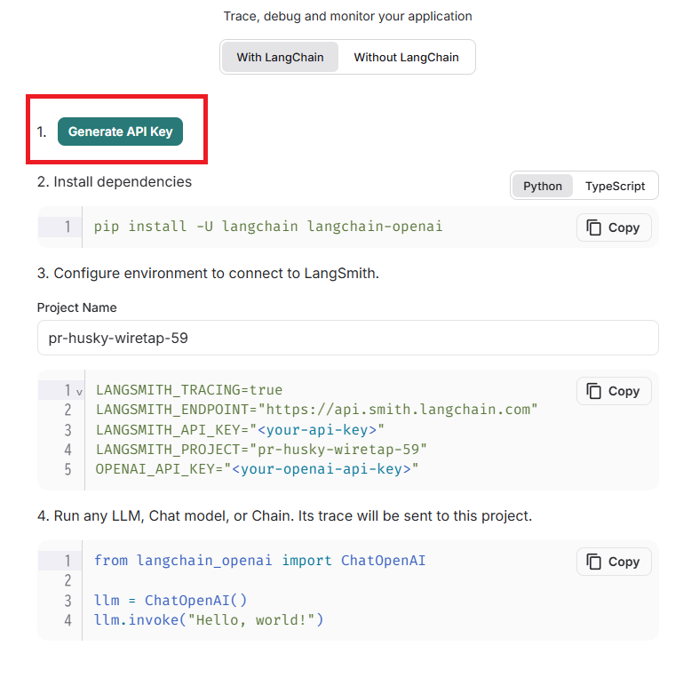
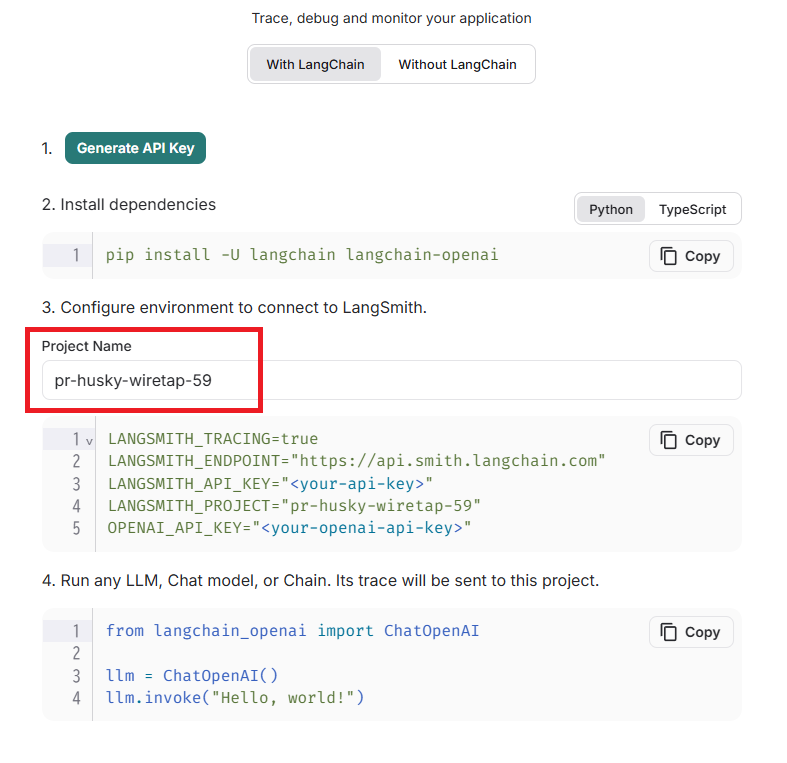
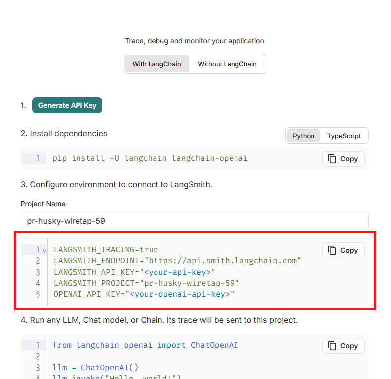
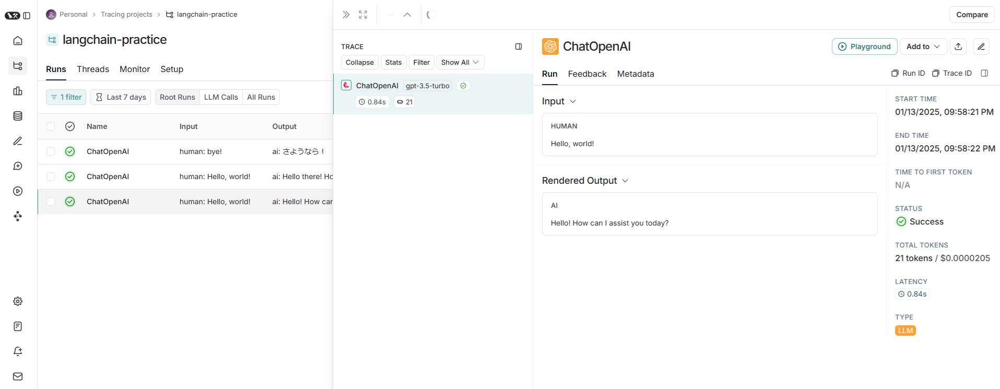

# README

## プロジェクト概要
生成AI技術の習得を目的として、[LangCahin公式サイト](https://python.langchain.com/docs/introduction/)に記載されているサンプルプログラムを実行できる環境を構築し、OpenAI SDKやLangChainを実際に動かせる環境を整えることが目的である。

## 環境構築手順

### 前提条件
- Dockerがインストールされていること

### .envファイルの作成
.envファイルを作成し、以下のようにopenAIのシークレットキーを記載する。
```
OPENAI_API_KEY=(your-secret-key)
```

### Dockerイメージのビルド
```
docker-compose build
```

### コンテナ起動
```
docker-compose up
```

## ファイル構造
コンテナ内は以下のようなファイル構造をしている。
```
/app/
├── docker-compose.yml  # Docker Compose 設定ファイル
├── .env                # 環境変数設定ファイル
├── src/                # アプリケーションのソースコード
│   ├── test.py         # LangSmith疎通確認用コード
│   ├── 00.py           # 環境変数確認用コード
│   ├── 01.py           # Build a simple LLM application with chat models and prompt templates ~Using Language Models~
│   └── 02.py           # Build a simple LLM application with chat models and prompt templates ~Prompt Templates~
├── Dockerfile          # アプリケーション用 Dockerfile
├── requirements.txt    # Python依存パッケージ定義ファイル
└── README.md
```

## プログラム実行方法
各プログラムはsrcディレクトリに格納されてるので、以下のように個別に実行することができる。
```
python 00.py
```

## LangSmith設定

### LangSmithとは
LangSmithとはLangChainの開発チームが提供するツールで、生成AIを使用したアプリケーションのトラッキングとデバッグを支援するためのプラットフォームのことである。LangSmithを利用することで、AIモデルの入出力・プロンプトのパフォーマンス・エラーの発生状況などを追跡・可視化することができる。



### LangSmith設定手順

#### 1. LangSmithアカウント作成
[公式サイト](https://www.langchain.com/langsmith)でアカウントを作成する。

#### 2. プロジェクト作成
ログイン後のダッシュボード画面の左または画面中央あたりに表示されている「TracingProject」を押下し、遷移した画面で「New Project」を押下する。





#### 3. API Keyの生成
「Generate API Key」を押下するとAPI Keyが表示されるので控えておく。



#### 4. Project Nameの設定
「Project Name」入力フォームに任意のプロジェクト名を設定する。



#### 5. 環境変数の設定
表示されている環境変数を.envファイルに追記する




.env
```
OPENAI_API_KEY=<your_openai_api_key>
LANGSMITH_TRACING=true
LANGSMITH_ENDPOINT=https://api.smith.langchain.com
LANGSMITH_API_KEY=<your_longsmith_api_key>
LANGSMITH_PROJECT=<your_project_name>
```

#### 6. コンテナ再ビルド(既にコンテナをビルドしている場合)

イメージビルド
```
docker-compose build
```

コンテナ起動
```
docker-compose up
```

#### 7. 疎通確認コードを実行する
/app/src/test.pyを実行し、実行内容がLangSmithに表示されるかを確認する。

```
python /app/src/test.py
```

正常に設定が完了すると以下のように表示される


